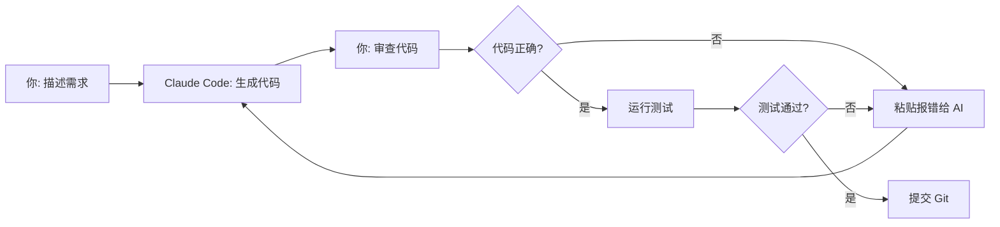

# 多智能体投资决策平台 · AI 驱动技术实现方案

> **TL;DR**：完整平台的技术蓝图（Phase 0~4）。核心架构：数据采集→辩论决策→风控→交易执行→记忆反思。当前 Phase 1 已实现 data + debate + memory 层。未实现：backtest、risk、前端。
>
> **跳过条件**：日常功能开发不需要读 — 模块接口以 Pydantic 模型和实际代码为准。只在做架构规划/新增模块时参考。

> 面向没有金融 AI 开发经验的开发者，用 Claude Code + 主流 AI 工具搭建完整平台
> 版本：v1.0 | 2026-06-03

---

## 第一章 · 核心思路：AI First 开发法

### 1.1 三条铁律

| # | 原则 | 说明 |
|---|------|------|
| 1 | **让 AI 写代码，你来决策** | AI 负责生成 80% 的代码，你负责：定架构 → 审代码 → 改 Bug → 联调 |
| 2 | **从最小闭环开始，逐层加码** | 永远先跑通"命令行能跑"的最小版本，再加 Web/数据库/Kafka |
| 3 | **让 AI 帮你调试** | 遇到报错就把完整堆栈扔给 AI，让它分析原因 + 给修复方案 |

### 1.2 开发工具链

| 工具 | 用途 | 获取方式 |
|------|------|---------|
| **Claude Code** | 主力 AI 编程助手（代码生成 + Debug + 架构设计）| `npm install -g @anthropic-ai/claude-code` |
| **Cursor** | 备选 AI IDE（对新手更友好，有图形界面）| cursor.com 下载 |
| **GitHub Copilot** | 行级代码补全（配合 Claude Code 互补）| github.com 订阅 |
| **VS Code + Continue** | 免费本地 AI 方案（接入 DeepSeek/Ollama）| 开源免费 |
| **Claude / ChatGPT** | 技术调研、架构咨询、Prompt 设计 | 网页版 |

**推荐组合**：Claude Code（主力写代码）+ ChatGPT/Claude 网页版（技术调研 + 架构咨询）

### 1.3 与 AI 协作的核心技巧

```
❌ 低效用法：
"帮我写一个多智能体投资平台" 

✅ 高效用法：
"我用 LangGraph 写一个多 Agent 交易框架，这是我的 Agent 定义：
  1. 新闻分析Agent：输入新闻文本，输出情绪评分+实体列表
  2. 行情Agent：输入股票代码，输出技术指标
  请帮我写出这两个 Agent 的 LangGraph 节点定义代码，Python"
```

**关键原则**：
- **分而治之**：每次只让 AI 写一个文件/一个函数/一个组件
- **给上下文**：把相关文件的内容贴给 AI，让它理解已有代码
- **用中文写注释**：AI 对中文需求理解很好，但生成的代码用英文标识符
- **迭代式开发**：先跑通 → 发现问题 → 贴给 AI 修 → 再跑通

---

## 第二章 · 环境准备（第 1-2 天）

### 2.1 基础环境

```bash
# 1. Python 环境
# 推荐用 conda 管理环境，省去很多依赖问题
# 下载：https://docs.conda.io/en/latest/miniconda.html

conda create -n litchi python=3.12
conda activate litchi

# 2. Node.js（前端用）
# 下载：https://nodejs.org/ （LTS 版本即可）
node --version  # >= 18

# 3. 安装 Claude Code
npm install -g @anthropic-ai/claude-code

# 4. 验证
claude --version
```

### 2.2 项目初始化（用 AI 完成）

用 Claude Code 执行以下指令，让它在 `e:\litchi-head` 下初始化项目结构：

```
cd e:\litchi-head
claude
```

然后在 Claude Code 中输入：

```
帮我初始化这个 Python 项目，要求：
1. 使用 pyproject.toml 管理依赖（不用 requirements.txt）
2. 目录结构如下：
   src/
     agents/        # Agent 定义
     core/          # 核心框架（编排器、通信协议）
     data/          # 数据采集模块
     backtest/      # 回测引擎
     memory/        # 记忆系统
     risk/          # 风控模块
     utils/         # 工具函数
   tests/           # 测试
   config/          # 配置
   docs/            # 文档
3. 安装基础依赖：langgraph, langchain, httpx, pydantic, pytest
4. 配置 ruff 作为 linter + formatter
5. 提供 pre-commit 配置
```

AI 会生成完整的项目骨架，包括 `pyproject.toml`、目录结构、基础配置。

### 2.3 确认关键依赖可用

```bash
# 验证 LangGraph 可用
python -c "from langgraph.graph import StateGraph; print('LangGraph OK')"

# 验证 LLM 连接（需要 API Key）
# 注册 DeepSeek（性价比高，适合开发期）：platform.deepseek.com
export DEEPSEEK_API_KEY="sk-your-key"

python -c "
from langchain_deepseek import ChatDeepSeek
llm = ChatDeepSeek(model='deepseek-chat')
print(llm.invoke('你好').content)
"
```

---

## 第三章 · Phase 0：开源基建 — AI 实现指南（第 1-3 周）

### 3.1 第一阶段目标

跑通一个**命令行可运行的 Agent 对话系统**，实现：
- 两个基础 Agent 能互相发送消息
- Agent 能调用 LLM 进行分析
- 结构化通信协议可用

### 3.2 第 1 步：核心编排框架 + 通信协议（3-5 天）

#### 要做什么

用 LangGraph 搭建最基础的 Agent 编排框架，实现一个简单的"分析师→评审"对话流程。

#### 在 Claude Code 中执行

```
Step 1：先让 AI 解释 LangGraph 的核心概念
```

在 Claude Code 中输入：

```
我是 Python 新手，用最简单的例子给我解释 LangGraph 的核心概念：
1. StateGraph 是什么？
2. Node 是什么？怎么定义？
3. Edge 是什么？条件边怎么用？
4. 给一个 "A说话→B回应→C总结" 的最简例子
```

```
Step 2：让 AI 编写通信协议
```

```
帮我定义 Agent 间通信的消息格式，使用 Pydantic：

消息类型包括：proposal(提案), challenge(质疑), response(回应), command(指令)
每条消息包含：message_id, sender, receiver, message_type, timestamp, payload, confidence, evidence_chain

要求：
1. 用 Pydantic BaseModel
2. 提供 JSON Schema 导出
3. 包含消息验证（必填字段检查、类型检查）
4. 写一个示例：新闻Agent向评审Agent发送一条新闻分析报告
```

AI 会生成类似这样的代码（示意）：

```python
# src/core/protocol.py
from pydantic import BaseModel, Field
from typing import Literal, Optional
from datetime import datetime
import uuid

class EvidenceItem(BaseModel):
    source: str
    source_message_id: str
    summary: str

class AgentMessage(BaseModel):
    message_id: str = Field(default_factory=lambda: str(uuid.uuid4()))
    sender: str
    receiver: str
    message_type: Literal["proposal", "challenge", "response", "command", "report"]
    timestamp: datetime = Field(default_factory=datetime.now)
    session_id: str
    payload: dict
    confidence: float = Field(ge=0, le=1, default=0.5)
    evidence_chain: list[EvidenceItem] = []
```

```
Step 3：让 AI 写 LangGraph 编排器
```

```
帮我用 LangGraph 写一个 Agent 编排器，实现以下流程：

流程：新闻Agent分析 → 行情Agent分析 → 评审Agent总结

每个 Agent 是一个独立的 Node，共享状态中包含：
- news_data: 新闻文本
- market_data: 行情数据
- analysis_results: 各Agent的分析结果列表
- final_summary: 最终总结

要求：
1. 用 TypedDict 定义状态
2. 每个 Agent 节点调用 LLM（用 langchain 的 ChatDeepSeek）
3. 节点之间通过状态传递消息
4. 运行完成后打印所有 Agent 的输出
```

```
Step 4：让 AI 写一个测试脚本验证
```

```
帮我写一个端到端测试脚本 test_simple_flow.py：
1. 模拟输入：一条新闻文本 + 一个股票代码
2. 运行上面定义的 Agent 编排器
3. 打印每个 Agent 的中间输出
4. 验证最终输出不为空

用 pytest 格式写，mock 掉 LLM 调用（返回固定文本）
```

#### 验证标准

```bash
# 运行测试
pytest tests/test_simple_flow.py -v

# 手动测试（需要 API Key）
python -m src.test_simple_flow
```

> 如果报错，**直接把完整报错信息复制给 Claude Code**，让它修。这是 AI 开发的核心工作流。

---

### 3.3 第 2 步：基础 Agent 实现（3-5 天）

#### 在 Claude Code 中依次执行

```
任务 1：新闻分析 Agent
```

```
帮我实现一个新闻分析 Agent，功能如下：

输入：原始新闻文本（字符串）
输出结构：
{
  "summary": "200字以内摘要",
  "sentiment": "positive/negative/neutral",
  "sentiment_score": 0.0-1.0,
  "entities": [{"name": "公司名", "type": "company/Person/Industry"}],
  "key_points": ["要点1", "要点2", "要点3"],
  "relevance_to_market": "该新闻对市场的影响判断"
}

要求：
1. 用 Pydantic 定义输入/输出模型
2. 使用 LangChain 调用 ChatDeepSeek
3. 输出必须结构化为 Pydantic 模型（用 with_structured_output）
4. 写单元测试（mock LLM 返回固定 JSON）
```

```
任务 2：行情分析 Agent
```

```
帮我实现一个行情分析 Agent（先用模拟数据），功能：

输入：股票代码 + 时间范围
输出结构：
{
  "ticker": "股票代码",
  "price": {"current": 100.0, "change_pct": 2.5},
  "technical_indicators": {
    "rsi_14": 55.0,
    "macd": {"value": 1.2, "signal": 0.8, "histogram": 0.4},
    "bollinger": {"upper": 110.0, "middle": 100.0, "lower": 90.0},
    "volume_ratio": 1.5
  },
  "analysis": "技术面分析结论文本"
}

要求：
1. 先不用真数据源，用 yfinance 或随机生成模拟数据
2. 指标计算可以委托 LLM 完成
3. Agent 输出结构化 Pydantic 模型
4. 写测试验证输出字段完整性
```

```
任务 3：教育 Agent "小智"
```

```
帮我实现一个投资教育 Agent，功能：

能力列表：
1. 解释金融概念（输入"什么是MACD？"→ 输出通俗解释）
2. 解读技术指标图（输入指标数值 → 输出图形化ASCII描述+含义）
3. 产业链查询（输入"半导体产业链" → 输出上下游结构）

要求：
1. 使用 RAG 模式：预置一个知识库（MACD/KDJ/PE/ROE 等常见指标的解释）
2. 知识库存为 Markdown 文件，用向量检索（先用简单的文本匹配）
3. 概念解释标注"易懂指数"（1-5星）
4. 支持追问（基于对话历史继续解释）
```

#### 这一阶段的 AI 工作流



---

### 3.4 第 3 步：大师 Agent 原型（2-3 天）

#### 在 Claude Code 中执行

```
帮我实现一个"投资大师 Agent"，要求：

实现两位大师：
1. 沃伦·巴菲特（价值投资风格）
2. 查理·芒格（逆向思维风格）

每位大师 Agent 的功能：
1. 对一只股票给出买入/持有/卖出的判断
2. 输出置信度评分（1-10）
3. 推理过程引用大师的经典语录或原则

技术实现：
1. 系统提示词包含大师的投资哲学描述
2. 用 RAG 从大师语料库（Markdown 文件）检索相关原则
3. 输出结构化为 Pydantic 模型

大师语料库（先放几个经典段落作为 Markdown 文件）：
- 巴菲特：'在别人恐惧时贪婪'、'护城河'、'安全边际'等核心概念的解释
- 芒格：'反过来想'、'能力圈'、'多元思维模型'等

写一个测试：让两位大师同时分析"贵州茅台"，对比他们的输出差异。
```

AI 生成的提示词示例（示意）：

```
巴菲特的系统提示词：
你以沃伦·巴菲特的投资风格分析以下股票。
核心原则：
1. 护城河：公司是否有持久的竞争优势？
2. 安全边际：当前价格是否低于内在价值？
3. 长期持有：是否愿意持有该股票10年？
4. 能力圈：你是否真正理解这家公司的生意？

请基于这些原则，结合检索到的巴菲特经典语录，输出你的分析。
```

---

### 3.5 Phase 0 验证标准

```
✅ 在命令行运行以下场景成功：

# 场景 1：单 Agent 测试
python -m src.agents.news_agent --text "美联储宣布降息50个基点"
→ 输出结构化分析报告

# 场景 2：大师 Agent 测试
python -m src.agents.master_agent --master buffett --ticker 600519
→ 输出巴菲特风格的分析 + 引用语录

# 场景 3：两 Agent 对话
python -m src.core.orchestrator --flow simple
→ 新闻Agent分析 → 行情Agent分析 → 评审Agent总结

# 场景 4：运行全部测试
pytest tests/ -v
→ 全部通过
```

---

## 第四章 · Phase 1：MVP 核心链路 — AI 实现指南（第 4-12 周）

### 4.1 数据采集模块（1-2 周）

#### 整体策略

由于金融数据源的复杂性，采用**分层策略**：

| 优先级 | 数据源 | 接入方式 | 用 AI 做什么 |
|--------|--------|---------|-------------|
| P0 | A股日K线 + 基本面 | **akshare**（免费 Python 库） | 写封装代码 |
| P0 | A股新闻 + 公告 | **东方财富 API**（akshare 封装好）| 写采集 + 清洗 |
| P1 | 同花顺接口 | 同花顺 iFinD / 模拟交易 | ⚠️ 需手工调研 |
| P2 | 美股 + 国际新闻 | yfinance + FinnHub | 写适配器 |

#### 在 Claude Code 中执行

```
任务：数据采集模块
```

```
帮我实现 A 股数据采集模块，使用 akshare 库。

功能列表：
1. 获取个股日K线数据（输入股票代码 + 起止日期）
2. 获取个股基本面数据（PE/PB/ROE/营收增长率）
3. 获取板块资金流向
4. 获取实时行情快照

要求：
1. 所有函数有完整的 try/except 错误处理
2. 数据缓存（避免重复请求）
3. 输出统一为 Pandas DataFrame
4. 写单元测试（mock akshare 返回值）
5. 数据字段命名中文注释

安装：pip install akshare pandas
```

```
任务：新闻采集模块
```

```
帮我实现新闻采集模块，使用 akshare 的新闻接口 + requests 爬取。

功能：
1. 获取东方财富个股新闻（按股票代码）
2. 获取财联社快讯（实时宏观新闻）
3. 新闻去重 + 简单清洗
4. 输出结构化 DataFrame：时间/标题/摘要/来源/链接

要求：
1. 频率控制（不要请求过快被封）
2. 错误重试（指数退避）
3. 缓存当天已获取的新闻
4. 写测试
```

#### ⚠️ 关于同花顺对接的技术调研

这个需要你**手工完成**，AI 帮不了太多：

```bash
# 调研清单
1. 访问同花顺开放平台：https://open.10jqka.com.cn/
2. 确认以下问题：
   - 个人开发者能否注册？
   - 模拟交易 API 是否开放？
   - 实盘交易是否需要券商资质？
   - 是否有 Python SDK？

# 备选方案（如果同花顺不可行）
1. 聚宽（JoinQuant）— 有免费模拟交易 API，适合回测
2. 掘金（MyQuant）— 支持 A股 + 期货模拟交易
3. 自建模拟撮合引擎 — 用真实行情 + 简单订单簿
```

**如果同花顺不可行，让 AI 帮你搭模拟交易引擎**：

```
如果同花顺 API 无法获取，帮我实现一个模拟交易引擎：

功能：
1. 虚拟账户（初始资金 + 持仓记录）
2. 下单（买入/卖出 + 数量 + 价格）
3. 基于真实行情的模拟撮合（当日成交价成交）
4. 持仓查询 + 历史成交记录
5. 计算持仓盈亏

存储：用 SQLite（开发期）或 JSON 文件

这是 MVP 的替代方案，等确认同花顺接口后再替换。
```

---

### 4.2 辩论引擎实现（2-3 周）

这是项目的**核心复杂度所在**，也是 AI 最能发挥价值的地方——因为本质上是**提示词工程**。

#### 在 Claude Code 中依次执行

```
任务 1：单组辩论流程
```

```
帮我实现一个"单组辩论"流程，使用 LangGraph。

流程：
1. 3 位分析师 Agent 分别提出初始方案（并行）
2. 强制质疑轮：A质疑B，B质疑C，C质疑A（串行，3步）
3. 评审 Agent 总结，输出最终方案 + 评分

状态定义：
- session_id: str
- input_data: dict（新闻/行情/用户偏好）
- proposals: list[dict]（3位分析师的方案）
- challenges: list[dict]（质疑记录）
- final_verdict: dict（评审的最终输出）

分析师提示词框架：
"你是一个{价值/成长/趋势/量化}风格的分析师。
当前市场数据：{market_data}
请提出你的投资方案，包括：标的、仓位比例、核心理由、预期收益。"

质疑提示词框架：
"请对以下方案提出至少3个质疑点：
方案：{proposal}
要求：具体、有数据支撑。"

评审提示词框架：
"请综合以下辩论内容，输出最终方案：
辩论记录：{debate_log}
要求：融合合理观点，给出评分(1-10)和三个关键词。"

要求：
1. 用 pytest 写端到端测试，mock LLM
2. 输出完整的辩论日志
3. 支持配置分析师风格
```

```
任务 2：四组并行辩论
```

```
在单组辩论的基础上，帮我实现四组并行辩论：
- 价值组（偏低估/高股息）
- 成长组（偏高增长/赛道）
- 趋势组（偏技术面/动量）
- 量化对冲组（偏统计套利/对冲）

要求：
1. 四组并行运行（用 Python asyncio 或 LangGraph 的并行节点）
2. 每组独立输出方案 + 评分
3. 综合排序服务：按评分 + 用户偏好加权排序
4. 输出四组的关键词云数据

额外功能 ⭐：
- 跨组交叉质疑：某一组可以挑战斗争议点
  实现方式：在四组都完成后，选择一个争议最大的话题，让相关组回应
```

```
任务 3：大师投票集成
```

```
把前面实现的大师 Agent 集成到辩论流程中：

1. 四组辩论完成后，将四组方案发送给大师 Agent
2. 每位大师独立投票（支持/反对/弃权）
3. 计算大师一致性指数（支持率最高的方案占比）
4. 大师投票结果作为最终排序的加权因子

输出更新：最终推荐列表增加 "大师支持率" 字段
```

#### 提示词调试技巧

这是整个项目**最需要反复调试**的部分。用 AI 辅助调试：

```bash
# 当你对辩论质量不满意时，把完整辩论日志贴给 Claude：
"
这是今天辩论的完整日志：{粘贴 log}
问题：价值组和成长组的方案几乎一样，没有区分度。
帮我分析原因并修改提示词，让两组产生更明显的风格差异。
"
```

---

### 4.3 风控 Agent 独立化（3-5 天）

```
帮我实现一个独立的风险控制 Agent，不参与方案生成，只做风险校验。

功能：
1. 组合风险计算：VaR(95%/99%)、最大回撤、波动率
2. 单票检查：仓位上限（默认20%）、流动性检查
3. 否决机制：输入交易信号 → 校验 → 通过/否决 + 原因
4. 每日风控报告生成

技术实现：
1. 用 Pydantic 定义输入/输出
2. 风控规则可配置（从 YAML/JSON 读取）
3. 风控 Agent 有独立的消息通道（不经过辩论流程）
4. command 类型消息有最高优先级

风控配置示例(config/risk.yaml)：
max_single_position: 0.2  # 单票最大仓位
max_daily_loss: 0.05       # 单日最大亏损
max_leverage: 1.0          # 最大杠杆
min_liquidity: 1000000     # 最低日均成交额
var_confidence: 0.95       # VaR 置信度

写测试：输入一个超出阈值的交易信号，验证否决生效。
```

---

### 4.4 记忆系统 MVP（1 周）

```
帮我实现三层记忆系统的 MVP 版本：

1. 工作记忆（Working Memory）
   - 存储当前 session 的辩论上下文
   - 用 Python dict + JSON 文件持久化（开发期）
   - 每个 session 结束后序列化到文件

2. 情景记忆（Episodic Memory）
   - 存储最近 30 条交易记录
   - 每条记录：时间/标的/方向/盈亏/反思
   - 用 SQLite 存储（开发期不急着上 PostgreSQL）

3. 反思机制（Reflection）⭐
   - 交易结束后自动触发
   - LLM 生成反思摘要
   - 反思摘要存储到 JSON 文件
   - 下次交易时加载最近5条反思作为参考

不用向量数据库（Phase 2 再加），先用关键词匹配。
```

---

### 4.5 Web 前端 MVP（2-3 周）

#### 前端策略

| 选项 | 优点 | 缺点 | 推荐 |
|------|------|------|------|
| **Streamlit** | 纯 Python，最快出界面 | 界面简陋，难定制 | ⭐ Phase 1 用 |
| React + Next.js | 专业，好看 | 需要前端知识 | Phase 2 迁移 |
| Gradio | 比 Streamlit 灵活些 | 同样不够专业 | 备选 |

**建议先用 Streamlit 出 MVP**，等产品验证后再重写为 React。

#### 在 Claude Code 中执行

```
帮我用 Streamlit 搭建投资决策平台的 MVP 前端，包含：

页面 1：今日推荐页
- 输入股票代码的搜索框
- "生成推荐"按钮
- 展示四组辩论方案的卡片（每组显示：方案摘要 + 评分 + 关键词）
- 展示大师投票结果（柱状图显示支持率）

页面 2：辩论详情页
- 点击任一方案卡片进入
- 展示完整的辩论过程（分析师初始方案 → 质疑 → 回应 → 评审总结）
- 争议点高亮显示

页面 3：教育助手页
- 输入框：问任何投资问题
- 显示回答 + 易懂指数
- 产业链查询

页面 4：账户页
- 显示虚拟账户持仓/资金
- 交易记录列表

要求：
1. 每个页面是一个单独的文件 pages/*.py
2. 用 st.session_state 管理状态
3. 用 st.cache_data 缓存数据
4. 美观：使用 st.columns, st.expander, st.metric 等组件
5. 主题色：深蓝 + 金色（金融风格）
```

---

## 第五章 · Phase 2：增强版辩论与记忆 — AI 实现指南（第 13-20 周）

### 5.1 强制质疑 + 跨组质疑上线（1-2 周）

这些功能**本质上还是提示词工程**，已经在 Phase 1 的辩论引擎中预留了扩展点。这里只需要：

```
帮我增强辩论流程，增加两个阶段：

第1阶段：组内强制质疑（在分析师提方案之后）
- 分析师A必须找出分析师B方案的3个漏洞
- 分析师B逐一回应
- 分析师C做裁判式对比

第2阶段：跨组交叉质疑（在四组都完成初评之后）
- 系统自动识别争议最大的3个话题
- 跨组互相挑战（如价值组质疑趋势组）
- 被挑战组必须在2轮对话内回应
- 挑战记录作为评审模型的额外输入

争议话题识别方法：
- 对比四组方案中分歧最大的股票/仓位/策略
- 用简单的差异评分（标准差大的话题优先）

输出更新：
- 每组输出增加 "争议点摘要" 字段
- 全局输出增加 "分歧热力图"（哪些话题争议最大）
```

### 5.2 多引擎回测系统（2-3 周）

```
帮我实现多引擎回测系统的三个核心引擎：

1. 事件驱动引擎（基础）
   - 按时间逐日推进
   - 处理买入/卖出信号
   - 考虑滑点(0.1%)和手续费(万2.5)
   - 输出每日净值曲线

2. Walk-Forward 引擎（防过拟合）
   - 滚动训练窗口(2年) → 测试窗口(6个月)
   - 输出样本外(OOS)绩效指标
   - 对比样本内 vs 样本外的绩效衰减

3. 蒙特卡洛模拟引擎（概率评估）
   - 基于历史收益的随机路径生成
   - 1000次模拟输出胜率区间
   - 输出：90%置信区间下的收益/回撤范围

三个引擎使用统一的接口：
class BacktestEngine:
    def run(self, strategy, data) -> BacktestResult
    
输出 BacktestResult 包含：
- net_value_series: List[float]
- metrics: Dict（年化收益/夏普/最大回撤/胜率等）
- trades: List[Trade]

先用 pandas DataFrame 作为数据格式，不用数据库。
```

### 5.3 长期记忆 + 向量检索（1-2 周）

```
帮我实现长期记忆的向量化存储和检索。

技术选型：
- 向量数据库：暂用 FAISS（轻量，无需部署服务）
- 嵌入模型：BGE-small-zh（中文效果好，轻量）
- 安装：pip install faiss-cpu sentence-transformers

功能：
1. 记忆存储：文本 → 向量 → FAISS 索引
2. 语义检索：查询文本 → 向量 → FAISS 搜索 Top-5
3. 记忆类型标签：reflection/trade/feedback/knowledge
4. 时间衰减：检索时按时间加权（近期记忆权重更高）

与反思机制联动：
- 交易反思完成后自动存储到 FAISS
- 下次辩论启动时检索相关反思作为参考输入
- 检索结果附在分析师提示词的上下文里
```

### 5.4 LoRA 微调平台（2-3 周）

> ⚠️ 这是**技术复杂度最高的模块**。MVP 阶段建议先做"伪反馈"。

**MVP 方案（先走通流程）**：

```
帮我实现一个简化的用户反馈 + 微调系统：

伪反馈阶段（不真的微调模型）：
1. 用户对推荐方案点 👍/👎
2. 反馈数据存入 JSON 文件
3. "模拟微调"：把用户最近的偏好作为额外提示词附加到 LLM 调用中
   - 用户偏好示例："用户近期偏好科技股"、"用户不喜欢高风险"
   - 这些偏好作为 system prompt 的附加内容

真实微调阶段（需要 GPU）：
1. 收集足够反馈后（建议 1000+ 条），启动离线微调
2. 使用 LLaMA-Factory 命令行
3. 微调 Qwen2.5-7B 或 DeepSeek 的小模型
4. LoRA 权重上传到 MinIO / 本地存储

配置项 config/finetune.yaml：
min_feedback_count: 1000
base_model: "Qwen/Qwen2.5-7B-Instruct"
lora_rank: 8
learning_rate: 2e-4
batch_size: 4
```

---

## 第六章 · AI 辅助调试与避坑指南

### 6.1 常见问题 & AI 求助模板

| 问题 | 症状 | 向 AI 求助的模板 |
|------|------|----------------|
| LangGraph 运行报错 | `KeyError`, `TypeError` | "我的 LangGraph 运行时报这个错：{堆栈}。代码是：{关键代码}。帮我分析原因并修复。" |
| LLM 输出不符合结构 | JSON 解析失败 | "我的 LLM 返回的 JSON 格式不对：{输出}。我定义的 Pydantic 模型是：{模型}。帮我修改提示词让它输出正确的结构。" |
| 辩论结果太相似 | 四组方案区分度低 | "四组辩论的输出几乎没有差异：{输出}。我的提示词是：{提示词}。请帮我修改提示词让不同组产生风格差异。" |
| 回测结果不合理 | 收益异常高/低 | "我的回测结果年化收益 200%+，明显不合理。回测逻辑：{代码}。请帮我检查 bug。" |
| 性能太慢 | 一次辩论要 2 分钟 | "我的四组辩论串行运行太慢，每组等 LLM 响应。帮我改成并行执行。" |

### 6.2 不要用 AI 做的事

| 事项 | 原因 | 正确做法 |
|------|------|---------|
| 金融数据源接入决策 | AI 不知道 API 是否可用、文档是否过期 | 你自己去官网注册和查看文档 |
| 法律法规合规判断 | AI 会自信地给出错误的法律建议 | 咨询专业律师 |
| 实盘交易执行 | AI 生成的代码可能包含 bug 导致损失 | MVP 阶段只用模拟交易 |
| 同花顺 API 密钥管理 | 安全敏感性极高 | 自己手动配置环境变量 |

### 6.3 项目进度管理建议

用 Claude Code 的 `/loop` 功能做每日站会：

```bash
# 每天早上执行
claude
> /loop 每天检查项目进度，提醒今天要完成的关键任务
```

---

## 第七章 · 文件结构总览

```
litchi-head/
├── pyproject.toml              # 项目配置 + 依赖
├── config/
│   ├── agents.yaml             # Agent 配置（模型/提示词模板）
│   ├── risk.yaml               # 风控阈值配置
│   └── finetune.yaml           # 微调参数配置
│
├── src/
│   ├── __init__.py
│   │
│   ├── core/                   # 核心框架
│   │   ├── orchestrator.py     # LangGraph 编排器
│   │   ├── protocol.py         # 通信协议 (Pydantic)
│   │   └── scheduler.py        # 任务调度器
│   │
│   ├── agents/                 # Agent 定义
│   │   ├── base.py             # Agent 基类
│   │   ├── news_agent.py       # 新闻分析 Agent
│   │   ├── market_agent.py     # 行情分析 Agent
│   │   ├── master_agent.py     # 大师人格 Agent
│   │   ├── education_agent.py  # 教育助手 Agent
│   │   ├── risk_agent.py       # 风控 Agent
│   │   └── trader_agent.py     # 交易策略 Agent
│   │
│   ├── debate/                 # 辩论引擎
│   │   ├── group.py            # 单组辩论流程
│   │   ├── parallel.py         # 四组并行调度
│   │   ├── challenge.py        # 质疑机制
│   │   └── ranking.py          # 综合排序
│   │
│   ├── memory/                 # 记忆系统
│   │   ├── working_memory.py   # 工作记忆
│   │   ├── episodic_memory.py  # 情景记忆
│   │   └── reflection.py       # 反思机制
│   │
│   ├── data/                   # 数据采集
│   │   ├── market_data.py      # 行情数据 (akshare)
│   │   ├── news_crawler.py     # 新闻采集
│   │   └── account.py          # 账户接口
│   │
│   ├── backtest/               # 回测引擎
│   │   ├── event_driven.py     # 事件驱动引擎
│   │   ├── walk_forward.py     # Walk-Forward 引擎
│   │   └── monte_carlo.py      # 蒙特卡洛模拟
│   │
│   ├── risk/                   # 风控模块
│   │   ├── calculator.py       # 风险指标计算
│   │   └── rules.py            # 风控规则引擎
│   │
│   └── utils/                  # 工具函数
│       ├── llm.py              # LLM 调用封装
│       └── config.py           # 配置加载
│
├── data/                       # 数据文件（gitignore）
│   ├── master_corpus/          # 大师语料库 (Markdown)
│   ├── knowledge_base/         # 教育知识库
│   └── user_feedback/          # 用户反馈数据
│
├── tests/                      # 测试
│   ├── test_agents/
│   ├── test_debate/
│   ├── test_memory/
│   └── test_backtest/
│
├── frontend/                   # Web 前端
│   └── streamlit_app/          # Phase 1: Streamlit MVP
│       ├── app.py              # 主入口
│       └── pages/              # 多页面
│           ├── 01_recommend.py
│           ├── 02_debate.py
│           ├── 03_education.py
│           └── 04_account.py
│
└── docs/                       # 文档
    ├── 设计方案-v1.0-改进版.md
    ├── 调研报告-xx.md
    └── 技术实现方案-AI驱动版.md
```

---

## 第八章 · AI 指令速查表

以下是每个开发阶段可以直接复制给 Claude Code 的指令：

### 初始化
```
帮我初始化一个 Python 项目，使用 pyproject.toml，目录包含 src/ tests/ config/，
安装 langgraph langchain-deepseek pydantic httpx akshare pandas ruff pytest。
```

### Agent 开发
```
帮我实现一个 {Agent名}，输入是 {输入类型}，输出是 {输出类型}，
使用 LangChain 调用 LLM，输出结构化为 Pydantic 模型。
```

### 调试
```
我的代码运行报错：{粘贴报错}
代码位置：{文件路径}
帮我分析原因并修复。
```

### 测试
```
帮我写 {模块名} 的 pytest 单元测试，mock 掉 LLM 调用，
测试正常流程和异常流程。
```

### 重构
```
帮我重构 {文件名}，把 {功能} 拆分为独立的模块，
保持接口兼容。
```

---

## 第九章 · 总结：从零开始的执行路线

| 周次 | 做什么 | 交付物 | 用 AI 做什么 |
|------|--------|--------|-------------|
| **第 1 天** | 搭环境 + 项目初始化 | 项目骨架可运行 | AI 写 pyproject.toml + 目录 |
| **第 2-3 天** | LangGraph 学习 + 编排器 | 两Agent可对话 | AI 写编排器代码 + 解释概念 |
| **第 4-5 天** | 通信协议 + 基础Agent | Agent输入/输出可验证 | AI 写 Pydantic 模型 + Agent 逻辑 |
| **第 6-7 天** | 大师Agent原型 | 巴菲特+芒格可对话 | AI 写提示词 + RAG 检索 |
| **第 2 周** | 数据采集模块 | akshare 行情+新闻可获取 | AI 写采集 + 缓存 + 测试 |
| **第 3 周** | 单组辩论MVP | 3分析师+评审可辩论 | AI 写 LangGraph 辩论流程 |
| **第 4 周** | 四组辩论 + 大师投票 | 完整辩论流程可运行 | AI 写并行调度 + 集成 |
| **第 5 周** | 风控Agent + 记忆MVP | 风控可否决 + 记忆可存储 | AI 写风控规则 + 反思机制 |
| **第 6 周** | Streamlit 前端MVP | 四个页面可交互 | AI 写全部前端代码 |
| **第 7-8 周** | 端到端联调 + Bug修复 | 全链路跑通 | AI 修 Bug + 优化提示词 |
| **第 9+ 周** | Phase 2 功能迭代 | 强制质疑/多引擎回测等 | AI 增量开发 |

> **关键心态**：你不是在"编程"，你是在**用 AI 做产品**。你的工作是：描述清楚需求 → 审查 AI 生成的代码 → 运行测试 → 把错误扔回给 AI 修 → 重复。你的价值在于**知道该做什么**，而不在于手写每一行代码。
