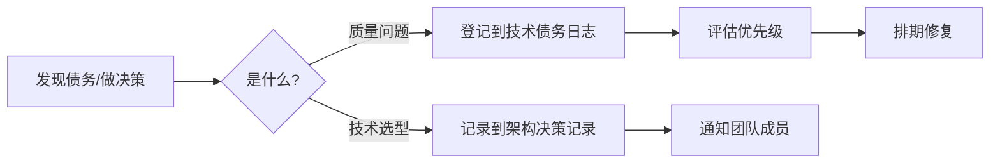

# 📋 技术债务与架构决策

> 两个并行的工程管理流程：
> - **技术债务日志** — 记录已知的质量问题、分类分级、跟踪修复
> - **架构决策记录** — 记录关键的选型决策、理由和舍弃方案

---

## 文件索引

| 文件 | 说明 | 适用场景 |
|------|------|---------|
| [技术债务日志.md](技术债务日志.md) | 🐛 技术债务管理系统 | 发现代码/设计问题时登记，评估后排期修复 |
| [债务新增模板.md](债务新增模板.md) | 📝 新增债务模板 | 新增债务时复制此模板填写 |
| [架构决策记录.md](架构决策记录.md) | 🏛️ 架构决策记录（ADR） | 做重要技术选型时记录 |

## 工作流程

## 分类速查

| 类型 | 文件 | 流程 |
|------|------|------|
| 🏛️ 架构设计不合理 | 技术债务日志 | 评估 → 排期 → 修复 |
| 💻 代码实现缺陷 | 技术债务日志 | 评估 → 排期 → 修复 |
| 🧪 测试缺失 | 技术债务日志 | 评估 → 排期 → 修复 |
| ✅ ADR 选型 | 架构决策记录 | 讨论 → 决策 → 记录 |
| ✅ 方案对比 | 架构决策记录 | 列出方案 → 对比 → 记录理由 |
