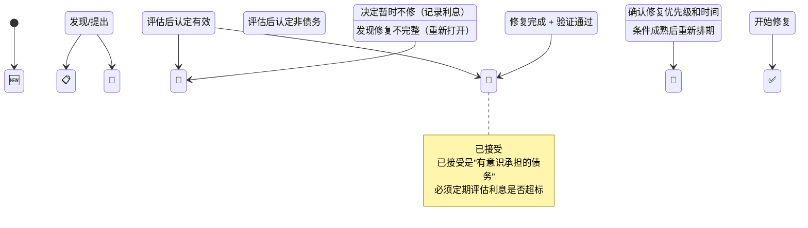
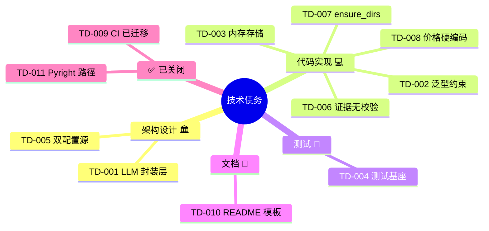
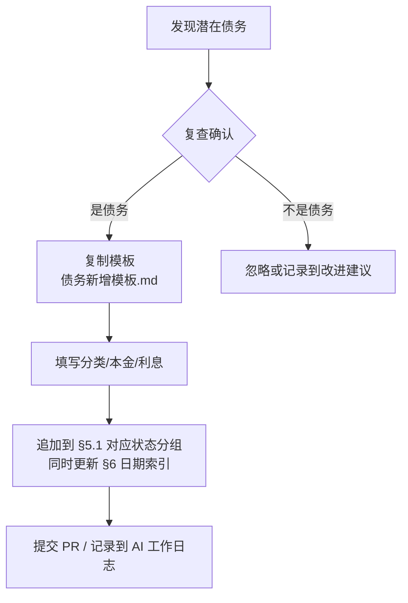

# 🐛 技术债务管理系统

> 技术债务（Technical Debt）是开发过程中为了速度而有意或无意做出的质量让步。
> 好的管理不是"零债务"，而是**知道欠了什么、利息多高、什么时候该还**。

---

## 目录

- [1. 核心概念](#1-核心概念)
- [2. 债务分类体系](#2-债务分类体系)
- [3. 债务生命周期](#3-债务生命周期)
- [4. 债务管理流程](#4-债务管理流程)
- [5. 当前债务清单](#5-当前债务清单)
- [6. 按发现日期索引](#6-按发现日期索引)
- [7. 债务仪表盘](#7-债务仪表盘)
- [附录A：分类速查表](#附录a分类速查表)
- [附录B：新增债务操作指南](#附录b新增债务操作指南)

---

## 1. 核心概念

### 1.1 什么是技术债务

```
💳 本金 = 修复这个问题的工时
💸 利息 = 每天不修复带来的额外成本（开发减速 + Bug 风险 + 士气损耗）
📊 本金/利息比 = 决定优先级的关键指标
```

### 1.2 债务容忍度原则

| 阶段 | 容忍度 | 策略 |
|------|--------|------|
| **Phase 0** — 基建期 | 🟢 高 | 允许短期债务换取速度，但必须有记录 |
| **Phase 1** — MVP 期 | 🟡 中 | 只允许已知可控的债务，关键路径必须清偿 |
| **Phase 2+** — 迭代期 | 🔴 低 | 新代码原则上零债务引入，旧债按计划清偿 |

> **当前阶段：Phase 0**，容忍度高但必须记录每一笔债务。

---

## 2. 债务分类体系

每条债务从四个维度分类：

### 2.1 按类型（Type）

| 类型 | 标签 | 示例 |
|------|------|------|
| **架构设计** | `🏛️ design` | 模块拆分不合理、缺少抽象层 |
| **代码实现** | `💻 implementation` | 缺少错误处理、硬编码、类型不安全 |
| **测试** | `🧪 testing` | 缺少 Mock 工具、测试覆盖率不足 |
| **基础设施** | `⚙️ infrastructure` | CI 不完善、缺少自动化工具 |
| **文档** | `📝 documentation` | 缺少 API 文档、配置说明不清晰 |
| **安全** | `🔒 security` | API Key 管理、数据加密、审计日志 |
| **性能** | `⚡ performance` | 不必要的串行、缓存缺失 |
| **可观测性** | `📊 observability` | 日志不足、缺少指标监控 |

### 2.2 按严重度（Severity）

| 等级 | 标签 | 定义 | 响应时限 |
|------|------|------|---------|
| S0 🔴 致命 | `severity:critical` | 阻塞开发，无法推进后续任何功能 | 立即修复 |
| S1 🟠 严重 | `severity:major` | 影响核心功能质量，迟早引发 Bug | 本周内 |
| S2 🟡 中等 | `severity:moderate` | 影响代码可维护性，长期拖慢开发 | 本 Sprint |
| S3 🟢 轻微 | `severity:minor` | 代码整洁度问题，可逐步优化 | 有计划即可 |
| S4 ⚪ 建议 | `severity:enhancement` | 改进建议，非缺陷 | 待排期 |

### 2.3 按模块（Module）

| 模块 | 范围 |
|------|------|
| `core` | 通信协议、编排器、调度器 |
| `agents` | Agent 基类、具体 Agent 实现 |
| `debate` | 辩论引擎、质疑机制、排序 |
| `memory` | 三层记忆系统 |
| `risk` | 风控模块 |
| `backtest` | 回测引擎 |
| `data` | 数据采集 |
| `utils` | 工具函数（LLM、配置、日志） |
| `tests` | 测试基础设施 |
| `infra` | CI/CD、部署、项目配置 |

### 2.4 按影响域（Impact）

- **开发速度** — 拖慢新功能开发
- **代码质量** — 降低可读性、可维护性
- **运行时稳定** — 可能导致崩溃或数据丢失
- **安全性** — 可能导致信息泄露
- **可测试性** — 使测试难以编写
- **可部署性** — 使部署复杂化

---

## 3. 债务生命周期

每条债务从发现到关闭经历以下状态：



### 状态说明

| 状态 | 含义 | 负责人 |
|------|------|--------|
| 🆕 待评估 | 刚发现，需要评估 | 发现者 |
| 📋 已确认 | 评估通过，确认为债务 | 技术负责人 |
| 📌 已排期 | 已安排修复时间和资源 | 项目经理 |
| 🔧 修复中 | 正在修复 | 开发者 |
| ✅ 已关闭 | 修复完成并通过验证 | 审查者 |
| 📖 已接受 | 有意保留，不修 | 技术负责人 |
| 🚫 已驳回 | 认定为非债务 | 技术负责人 |

---

## 4. 债务管理流程

### 4.1 发现 → 登记

任何人（包括 AI）在审查中发现的技术债务，必须登记。

**登记检查清单**：
- [ ] 是否确实是债务，而非未完成的功能？（→ 功能用 Todo，债务用 Debt）
- [ ] 是否已有同类债务？（→ 合并，不重复）
- [ ] 分类是否准确？（类型 + 严重度 + 模块 + 影响域）
- [ ] 利息描述是否清晰？（不修会怎样）

### 4.2 评估 → 决策

| 本金（修复工时） | 利息 | 决策 |
|-----------------|------|------|
| 小（< 2h） | 高 | 🔧 立即修复 |
| 小（< 2h） | 低 | 📌 排入下一轮 Sprint |
| 中（2h-2d） | 高 | 📌 排入当前 Sprint |
| 中（2h-2d） | 低 | 📖 接受，定期复查 |
| 大（> 2d） | 高 | 📌 排入专项 Sprint |
| 大（> 2d） | 低 | 📖 接受，年度复查 |

### 4.3 修复 → 关闭

修复完成后需要验证：

- [ ] 修复代码经过 Code Review
- [ ] 相关测试已添加/更新
- [ ] CI 流水线通过
- [ ] 关联文档已更新
- [ ] 相关 ADR 已记录（如果是架构变更）

---

## 5. 当前债务清单

### 5.1 按状态分组

#### 🆕 待评估（0 条）

> 无。

#### 📋 已确认（11 条）

##### S0 🔴 致命 · 影响开发速度

---

###### TD-001 缺少 LLM 调用封装层

| 属性 | 值 |
|------|-----|
| **ID** | TD-001 |
| **分类** | `🏛️ design` `severity:critical` `module:utils` `impact:开发速度` |
| **发现日期** | 2026-06-05 |
| **发现人** | AI 项目审视 |
| **状态** | `🔧 修复中` |
| **本金估算** | ∼4h (实现 `llm.py` + 测试) |
| **实际工时** | ∼1.5h（核心实现完成，测试待补） |
| **日利息** | ~~⛔ 开发完全阻塞~~ → 🟡 基础层已可用 🟢 CI 验证通过，风险进一步降低 |

**描述**：
项目没有 `src/utils/llm.py`，Agent 无法调用任何 LLM。这是整个平台的引擎，所有业务逻辑都依赖它。

**具体问题**（✅ 已修复 / ❌ 待处理）：
1. ✅ `ChatDeepSeek` / `ChatOpenAI` 的统一封装 — `LLMService.get_llm()`
2. ✅ `with_structured_output()` 的结构化输出支持 — `LLMService.invoke_structured()`
3. ✅ 错误重试和指数退避（tenacity） — `_call_with_retry()` 内建
4. ✅ `cost_tracker.py` 集成 — `_record_usage()` 自动记录每次调用
5. ⬜ 模型路由（简单/复杂任务用不同模型）— 设计在补充文档中，当前用 settings.llm_provider 切换

**当前实现**：
| 接口 | 签名 | 覆盖 |
|------|------|------|
| `get_llm()` | `(provider: str \| None = None) -> BaseChatModel` | ✅ 按 provider 缓存实例 |
| `ainvoke()` | `(prompt, system_prompt, provider, agent_name, session_id) -> str` | ✅ 文本调用 + 重试 + 费用 |
| `invoke_structured()` | `(prompt, output_model, system_prompt, provider, agent_name, session_id) -> BaseModel` | ✅ 结构化输出 + 重试 + 费用 |
| `clear_cache()` | `() -> None` | ✅ 清空实例缓存 |

**关联文档**：
- [技术实现方案-AI驱动版.md](../技术实现方案-AI驱动版.md) §2.3 — LLM 连接验证
- [技术实现方案-增强补充.md](../技术实现方案-增强补充.md) 补充 B — 模型路由设计
- [架构决策记录.md](架构决策记录.md) ADR-007 — DeepSeek 作为主力 LLM

---

##### S2 🟡 中等

---

###### TD-002 AgentResult.data 缺少泛型约束

| 属性 | 值 |
|------|-----|
| **ID** | TD-002 |
| **分类** | `💻 implementation` `severity:moderate` `module:agents` `impact:代码质量` |
| **发现日期** | 2026-06-05 |
| **状态** | `📋 已确认` |
| **本金估算** | ∼30min |
| **日利息** | 🟡 每新增一个 Agent，就多一份"data 里到底有什么"的困惑 |

**描述**：
`AgentResult.data` 类型为 `dict`，子类返回什么结构全靠惯例。

```python
# 当前
class AgentResult:
    data: dict = field(default_factory=dict)

# 期望
class AgentResult(Generic[T]):
    data: T
```

**影响**：
- 下游消费者不知道 data 里有什么字段
- Pyright 无法做静态校验
- 运行时可能 KeyError

**修复方向**：
```python
from typing import Generic, TypeVar
T = TypeVar('T')

@dataclass
class AgentResult(Generic[T]):
    data: T
    ...
```

---

###### TD-003 MessageRouter 纯内存存储

| 属性 | 值 |
|------|-----|
| **ID** | TD-003 |
| **分类** | `💻 implementation` `severity:moderate` `module:core` `impact:运行时稳定` |
| **发现日期** | 2026-06-05 |
| **状态** | `📋 已确认` |
| **本金估算** | ∼1h |
| **日利息** | 🟡 每次进程重启丢失所有消息，无法做消息重放和回溯 |

**描述**：
`MessageRouter._messages` 是内存 dict，进程重启全部丢失。

**利息分析**：
- Phase 0 影响不大（单次会话不跨进程）
- Phase 1 辩论系统上线后，需要持久化辩论记录

**修复方向**：
- 短期：添加 `save_snapshot()` / `load_snapshot()` JSON 持久化
- 长期：SQLite 存储（文档数据库设计已有）

---

###### TD-004 缺少测试基座和 Mock 工具

| 属性 | 值 |
|------|-----|
| **ID** | TD-004 |
| **分类** | `🧪 testing` `severity:moderate` `module:tests` `impact:可测试性` |
| **发现日期** | 2026-06-05 |
| **状态** | `🔧 修复中` |
| **本金估算** | ∼2h |
| **实际工时** | ∼1.5h（conftest.py + test_sanity.py + vcr_config.py + 4 个业务测试模块已完成） |
| **日利息** | 🟡 86 tests collected，但 debate/memory/data 等模块尚无测试 |

**描述**：
测试目录只有空 `__init__.py`，无实质测试，也无 Mock LLM 的工具。

**当前实现**（2026-06-06 更新）：
1. ✅ `tests/conftest.py` — 测试基座核心，含 `make_mock_llm_service()` / `make_mock_llm_sequence()` / `make_mock_llm_error()` 三个工厂函数
2. ✅ `tests/conftest.py` — 共享 fixtures（`mock_llm`, `sample_context`, `sample_result` 等）
3. ✅ `tests/vcr_config.py` — VCR 录制/回放配置
4. ✅ `tests/test_sanity.py` — 24 个冒烟测试
5. ✅ `tests/test_agents_base.py` — AgentContext + AgentResult + BaseAgent 核心业务（15 个测试）
6. ✅ `tests/test_core_protocol.py` — EvidenceItem + AgentMessage + MessageRouter（20 个测试）
7. ✅ `tests/test_utils_cost_tracker.py` — CostTracker 全功能覆盖（15 个测试）
8. ✅ `tests/test_utils_llm.py` — LLMService 非网络部分验证（12 个测试）
9. ⬜ 各模块正式业务测试（test_debate, test_memory, test_data 等）

**利息分析**：
- CI 跑 pytest → 86 tests collected ✅
- 已有测试基线覆盖 Agent/Protocol/CostTracker/LLMService
- 可安全重构已有代码
- debate/memory/data 等模块仍需补充

**修复方向**：
创建 `tests/conftest.py`：
- `make_mock_llm()` / `make_mock_llm_sequence()` 工具函数 ✅
- 各模块的共享 fixtures ✅
- VCR 录制配置 ✅
- 各模块业务测试 ✅（已覆盖 4 个核心模块）

---

###### TD-005 双配置源未协调

| 属性 | 值 |
|------|-----|
| **ID** | TD-005 |
| **分类** | `🏛️ design` `severity:moderate` `module:utils` `impact:开发速度` |
| **发现日期** | 2026-06-05 |
| **状态** | `📋 已确认` |
| **本金估算** | ∼1h |
| **日利息** | 🟢 低（当前不影响运行，但会导致困惑） |

**描述**：
`config/settings.yaml` 和 `src/utils/config.py`（Pydantic Settings）两套配置系统部分重叠，无明确优先级。

**利息分析**：
- 开发者不确定改 YAML 是否生效
- 新增配置项可能加到错误的位置

**修复方向**：
在文档中明确优先级规则（`.env` → `Settings` 默认值 → `settings.yaml`），或统一为单源。

---

###### TD-009 CI 流水线需从 Gitee 迁移到 GitHub Actions

| 属性 | 值 |
|------|-----|
| **ID** | TD-009 |
| **分类** | `⚙️ infrastructure` `severity:moderate` `module:infra` `impact:开发速度` |
| **发现日期** | 2026-06-05 |
| **发现人** | AI 全面审视 |
| **状态** | `✅ 已关闭` |
| **本金估算** | ∼30min |
| **实际工时** | ∼15min（创建 CI + 修复 Ruff E402 + 提交缺失测试文件 + 验证通过） |
| **日利息** | 🟢 已修复 |

**描述**：
项目已从 Gitee 迁移到 GitHub，但 CI 流水线未配置，GitHub 上无法自动运行代码检查。

**修复内容**（2026-06-06）：
1. ✅ `.github/workflows/ci.yml` — 创建 GitHub Actions 配置文件（Ruff + Pyright + Pytest on 3.12/3.13）
2. ✅ Ruff E402 修复 — `tests/conftest.py` 添加 `# ruff: noqa: E402` 豁免 src layout 导入顺序
3. ✅ 提交缺失测试文件 — `tests/test_sanity.py` 和 `tests/vcr_config.py` 之前未跟踪，CI 收集到 0 tests
4. ✅ CI 验证通过 — Python 3.12 / 3.13 双版本全部 3 项检查（Ruff / Pyright / Pytest）通过

**利息分析**：
- **修复前**：每次 push 到 GitHub 无自动检查，代码质量无保障
- **修复后**：每次 push main 自动执行 3 项检查，质量门禁到位

---

##### S3 🟢 轻微

---

###### TD-006 EvidenceItem 无校验逻辑

| 属性 | 值 |
|------|-----|
| **ID** | TD-006 |
| **分类** | `💻 implementation` `severity:minor` `module:core` `impact:代码质量` |
| **发现日期** | 2026-06-05 |
| **状态** | `📋 已确认` |
| **本金估算** | ∼30min |
| **日利息** | 🟢 辩论系统上线前利息为 0 |

**描述**：
`EvidenceItem` 只是数据容器，无任何校验逻辑。

**利息分析**：
- 当前阶段利息为 0（尚无 Agent 生成证据链）
- 辩论系统上线后，虚假证据无法被检测

**修复方向**：
添加 `validate_chain()` 方法，验证来源可追溯。

---

###### TD-007 ensure_dirs() 从未被调用

| 属性 | 值 |
|------|-----|
| **ID** | TD-007 |
| **分类** | `💻 implementation` `severity:minor` `module:utils` `impact:运行时稳定` |
| **发现日期** | 2026-06-05 |
| **状态** | `📋 已确认` |
| **本金估算** | ∼10min |
| **日利息** | 🟢 各模块自行创建目录，尚可工作 |

**描述**：
`config.py` 中的 `ensure_dirs()` 函数定义了目录创建逻辑但未被调用。

```python
# 定义了但从未被调用
def ensure_dirs():
    for d in [settings.data_dir, settings.log_dir]:
        Path(d).mkdir(parents=True, exist_ok=True)
```

**利息分析**：
- 当前各模块各自创建目录（logger 中 mkdir、cost_tracker 中 mkdir）
- 行为分散，未来改目录结构需要改 N 个地方

**修复方向**：
在 `Settings` 实例化后自动调用 `ensure_dirs()`。

---

###### TD-008 cost_tracker 模型价格硬编码

| 属性 | 值 |
|------|-----|
| **ID** | TD-008 |
| **分类** | `💻 implementation` `severity:minor` `module:utils` `impact:可部署性` |
| **发现日期** | 2026-06-05 |
| **状态** | `📋 已确认` |
| **本金估算** | ∼30min |
| **日利息** | 🟢 改价格只需改几行代码，影响小 |

**描述**：
模型价格硬编码在 `cost_tracker.PRICES` 类属性中。

```python
PRICES = {
    "deepseek-chat": {"input": 0.5, "output": 1.0},
    "gpt-4o-mini": {"input": 2.5, "output": 10.0},
    "gpt-4o": {"input": 15.0, "output": 60.0},
}
```

**影响**：
- 模型调价需改代码 → 重新部署
- 新增模型需改代码

**修复方向**：
价格表移入 `config/prices.yaml`，运行时加载。

---

###### TD-010 README 仍为 Gitee 模板，缺少真正的中文 README

| 属性 | 值 |
|------|-----|
| **ID** | TD-010 |
| **分类** | `📝 documentation` `severity:minor` `module:infra` `impact:代码质量` |
| **发现日期** | 2026-06-05 |
| **发现人** | AI 全面审视 |
| **状态** | `📋 已确认` |
| **本金估算** | ∼30min |
| **日利息** | 🟢 非阻塞，但作为 GitHub 开源项目的门面影响第一印象 |

**描述**：
`README.en.md` 仍是 Gitee 模板生成的内容（含 Gitee 特有链接和说明），根目录缺少真正的中文 `README.md`。

**具体问题**：
1. ❌ `README.en.md` 含有 Gitee 引用（"Gitee Feature"、"Gitee blog" 等）
2. ❌ 无 `README.md`（只有 Gitee 生成的英文模板）
3. ❌ 项目介绍、安装说明、使用指南均缺失

**利息分析**：
- 影响 GitHub 上项目的第一印象
- 对潜在贡献者不友好
- 开源项目门面不专业

**修复方向**：
- 删除或替换 `README.en.md`
- 创建真正的中文 `README.md`（项目介绍、安装、使用、贡献指南）

---

###### TD-011 pyproject.toml 中 Pyright extraPaths 硬编码他人环境路径

| 属性 | 值 |
|------|-----|
| **ID** | TD-011 |
| **分类** | `⚙️ infrastructure` `severity:minor` `module:infra` `impact:可部署性` |
| **发现日期** | 2026-06-05 |
| **发现人** | AI 全面审视 |
| **状态** | `✅ 已关闭` |
| **本金估算** | ∼5min |
| **实际工时** | ∼1min |
| **日利息** | 🟢 已修复（移除硬编码路径，pip install -e . 后 pyright 自动识别） |

**描述**：
`pyproject.toml` 中 `[tool.pyright].extraPaths` 指向了他人的 Python 3.13 安装路径。

**修复内容**：
1. ✅ 移除 `extraPaths` 配置 — `pip install -e .` 后 pyright 自动识别包路径

**具体问题**：
1. ✅ 路径指向 `Users/HUAWEI` — 已移除
2. ✅ 路径指向 `Python313` — 已移除
3. ✅ 当前开发者运行 `pyright src/` — 不再因找不到依赖而失败

**利息分析**：
- 仅影响本地运行 pyright 类型检查
- 不影响 Ruff、Pytest 或其他工具
- 不影响项目运行

**修复方向**：
- 移除 `extraPaths` 配置（pip install -e . 后 pyright 自动识别包路径）
- 或改用相对路径/虚拟环境路径

### 5.2 完整清单速览

| ID | 标题 | 类型 | 严重度 | 模块 | 本金 | 利息趋势 | 状态 |
|----|------|------|--------|------|------|---------|------|
| TD-001 | 缺少 LLM 调用封装层 | 🏛️ design | 🔴 S0 | utils | ∼4h | 🟢 CI 验证通过，风险进一步降低 | 🔧 修复中 |
| TD-002 | AgentResult 缺泛型 | 💻 impl | 🟡 S2 | agents | ∼30min | 🟡 线性增长 | 📋 已确认 |
| TD-003 | MessageRouter 内存存储 | 💻 impl | 🟡 S2 | core | ∼1h | 🟡 线性增长 | 📋 已确认 |
| TD-004 | 缺少测试基座 | 🧪 testing | 🟡 S2 | tests | ∼2h | 🟢 核心模块已覆盖（86 tests），debate 等待补 | 🔧 修复中 |
| TD-005 | 双配置源未协调 | 🏛️ design | 🟡 S2 | utils | ∼1h | 🟢 缓慢 | 📋 已确认 |
| TD-006 | EvidenceItem 无校验 | 💻 impl | 🟢 S3 | core | ∼30min | 🟢 当前为零 | 📋 已确认 |
| TD-007 | ensure_dirs 未调用 | 💻 impl | 🟢 S3 | utils | ∼10min | 🟢 当前为零 | 📋 已确认 |
| TD-008 | 价格硬编码 | 💻 impl | 🟢 S3 | utils | ∼30min | 🟢 极低 | 📋 已确认 |
| TD-009 | CI 需迁移 GitHub Actions | ⚙️ infra | 🟡 S2 | infra | ∼30min | 🟢 已修复 | ✅ 已关闭 |
| TD-010 | README 仍为 Gitee 模板 | 📝 docs | 🟢 S3 | infra | ∼30min | 🟢 非阻塞 | 📋 已确认 |
| TD-011 | Pyright extraPaths 硬编码 | ⚙️ infra | 🟢 S3 | infra | ∼5min | 🟢 已修复 | ✅ 已关闭 |

---

## 6. 按发现日期索引

> 债务按发现日期分组，方便回溯每次 AI 审视发现了什么。
> 此列表自动从 §5 债务清单中提取，按日期降序排列。

### 2026-06-05

初始 8 条债务登记：

| ID | 标题 | 严重度 | 模块 | 本金 |
|----|------|--------|------|------|
| TD-001 | 缺少 LLM 调用封装层 | 🔴 S0 | utils | ∼4h |
| TD-002 | AgentResult 缺泛型 | 🟡 S2 | agents | ∼30min |
| TD-003 | MessageRouter 内存存储 | 🟡 S2 | core | ∼1h |
| TD-004 | 缺少测试基座 | 🟡 S2 | tests | ∼2h |
| TD-005 | 双配置源未协调 | 🟡 S2 | utils | ∼1h |
| TD-006 | EvidenceItem 无校验 | 🟢 S3 | core | ∼30min |
| TD-007 | ensure_dirs 未调用 | 🟢 S3 | utils | ∼10min |
| TD-008 | 价格硬编码 | 🟢 S3 | utils | ∼30min |

### 2026-06-05（第三次会话）

本次会话（远程迁移 Gitee→GitHub + 全面审视）变更：

| ID | 操作 | 说明 |
|----|------|------|
| TD-001 | 无变更 | 核心实现已完成，测试待补 |
| TD-004 | 利息更新: 🟡 → 🔴 | 迁至 GitHub 后 CI 真空期，利息升高 |
| TD-009 | 🆕 新增 | CI 流水线需从 Gitee 迁移到 GitHub Actions |
| TD-010 | 🆕 新增 | README 仍为 Gitee 模板 |
| TD-011 | 🆕 新增 | Pyright extraPaths 硬编码他人环境路径 |

### 2026-06-05（第四次+第五次会话）

本次会话（创建 GitHub CI + 修复 Pyright 路径 + 搭建测试基座）：

| ID | 操作 | 说明 |
|----|------|------|
| TD-004 | 状态更新: 📋 已确认 → 🔧 修复中 | 创建 `tests/conftest.py` + `tests/test_sanity.py` + `tests/vcr_config.py`，24 个冒烟测试通过 |
| TD-009 | 状态更新: 📋 已确认 → 🔧 修复中 | 创建 `.github/workflows/ci.yml` |
| TD-011 | 状态更新: 📋 已确认 → ✅ 已关闭 | 移除 pyproject.toml 中硬编码的 extraPaths |

### 2026-06-06

本次会话（修复 CI + 编写 62 个业务测试 + 关闭两条债务）：

| ID | 操作 | 说明 |
|----|------|------|
| TD-001 | 利息更新: 🟡 → 🟢 | CI 全绿通过后 LLM 封装层风险进一步降低 |
| TD-004 | 工时更新 + 利息更新 | 新增 62 个业务测试，86 tests collected，利息降低 |
| TD-009 | 状态更新: 🔧 修复中 → ✅ 已关闭 | CI 流水线验证通过（Ruff/Pyright/Pytest on 3.12/3.13 全绿） |

---

## 7. 债务仪表盘

### 6.1 统计汇总



### 6.2 严重度分布

```
S0 🔴 致命 │█ 1   ──→ 立即关注
S1 🟠 严重 │      ──→ 0
S2 🟡 中等 │████ 4   ──→ 本周/本 Sprint
S3 🟢 轻微 │████ 4   ──→ 有计划即可
S4 ⚪ 建议 │      ──→ 0
✅ 已关闭 │██ 2   ──→ TD-009 + TD-011
```

### 6.3 按模块分布

```
utils  │████████████████ 4   (TD-001,005,007,008)
core   │██████████ 2         (TD-003,006)
agents │████ 1               (TD-002)
tests  │████ 1               (TD-004)
docs   │████ 1               (TD-010)
infra  │██ 2 (已关闭)         (TD-009 ✅ TD-011 ✅)
```

### 6.4 总债务估算

```
开放债务本金: ~8.9 人时 (TD-009 关闭后减少 ~30min)
最高利息:   TD-004 debate/memory/data 等待补模块测试
紧急指数:   1.5/10 —— 核心模块已覆盖 86 tests，剩余为非关键模块
```

---

## 附录A：分类速查表

### 分类标签组合

```
标注格式: [类型] [严重度] [模块] [影响域]

示例:
TD-001 → `🏛️ design` `severity:critical` `module:utils` `impact:开发速度`
TD-004 → `🧪 testing` `severity:moderate` `module:tests` `impact:可测试性`
```

### 新增债务模板

```markdown
###### TD-NNN 标题（一句话）

| 属性 | 值 |
|------|-----|
| **分类** | `[类型]` `severity:[等级]` `module:[模块]` `impact:[影响域]` |
| **发现日期** | YYYY-MM-DD |
| **发现人** | 姓名 / AI 审视 |
| **状态** | `🆕 待评估` |
| **本金估算** | ∼Xh |
| **日利息** | 简要描述不修会怎样 |

**描述**：
（2-3 句话说明问题本质）

**具体问题**：
1. ❌ ...
2. ❌ ...

**利息分析**：
- ...

**修复方向**：
（期望的解决方案）
```

---

## 附录B：新增债务操作指南

### B.1 发现债务怎么办



### B.2 填写规范

1. **ID 编号**：按顺序递增，如当前最大 ID 是 TD-008，则下一条是 TD-009
2. **分类**：四维必须完整，缺一不可（类型 + 严重度 + 模块 + 影响域）
3. **本金估算**：使用 `∼Xh` 格式（如 `∼2h`、`∼30min`），`∼` 表示概数
4. **利息描述**：必须说明"不修会怎样"，最好量化
5. **发现人**：`AI 审视` 或具体人名

### B.3 每日更新 checklist

每次 AI 会话结束时：

- [ ] 本次审视发现了新的债务吗？→ 追加到日志
- [ ] 已有的债务状态有变化吗？→ 更新状态
- [ ] 利息评估需要更新吗？→ 调整利息描述
- [ ] 本次债务变更记录到 AI 工作日志了吗？→ 写入 `docs/ai-work-logs/`

---

> **更新日志**
> | 日期 | 操作 | 说明 |
> |------|------|------|
> | 2026-06-05 | 创建 | 初始 8 条债务登记，建立管理系统框架 |
> | 2026-06-05 | 更新 TD-001 | 状态变更：📋 已确认 → 🔧 修复中（`src/utils/llm.py` 核心实现完成） |
> | 2026-06-05 | 更新 TD-004 | 利息评估从 🟡 升至 🔴（迁至 GitHub 后 CI 真空期） |
> | 2026-06-05 | 新增 TD-009~011 | CI 迁移 / README 模板 / Pyright 路径（全面审视发现） |
> | 2026-06-05 | 仪表盘更新 | 更新所有统计指标反映新增 3 条债务 |
> | 2026-06-05 | 更新 TD-009 | 状态变更：📋 已确认 → 🔧 修复中（创建 `.github/workflows/ci.yml`） |
> | 2026-06-05 | 更新 TD-011 | 状态变更：📋 已确认 → ✅ 已关闭（移除 hardcoded extraPaths） |
> | 2026-06-05 | 更新 TD-004 | 状态变更：📋 已确认 → 🔧 修复中（创建测试基座 conftest.py + 24 tests） |
> | 2026-06-05 | 仪表盘更新 | 紧急指数从 3.0 降至 2.5（测试基座已搭好） |
> | 2026-06-06 | 更新 TD-009 | 状态变更：🔧 修复中 → ✅ 已关闭（CI 验证通过，3.12/3.13 全绿） |
> | 2026-06-06 | 更新 TD-001 | 利息评估：🟡 → 🟢（CI 验证通过，风险降低） |
> | 2026-06-06 | 仪表盘更新 | 紧急指数从 2.5 降至 2.0（CI 全绿 + 两条债务关闭） |
> | 2026-06-06 | 更新 TD-004 | 新增 62 个业务测试（Agent/Protocol/CostTracker/LLM），86 tests collected  |
> | 2026-06-06 | 利息评估更新 | TD-004 利息降低（业务测试已覆盖核心模块） |
